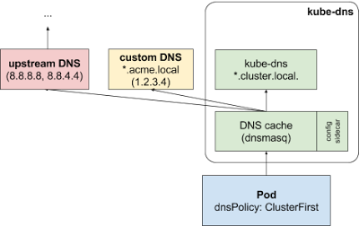

---
assignees:
- bowei
- zihongz
title: Configuring private DNS zones and upstream nameservers in Kubernetes
---


This page shows how to add custom private DNS zones (stub domains) and upstream
nameservers.



* The cluster must be configured to use the `kube-dns` addon.




## Name resolution in Kubernetes

The diagram below shows the flow of DNS queries specified in the configuration
above. With the dnsPolicy set to “ClusterFirst” a DNS query is first sent to
the DNS caching layer in kube-dns. From here, the suffix of the request is
examined and then forwarded to the appropriate DNS.  In this case, names with
the cluster suffix (e.g.; “.cluster.local”) are sent to kube-dns. Names with
the stub domain suffix (e.g.; “.acme.local”) will be sent to the configured
custom resolver. Finally, requests that do not match any of those suffixes will
be forwarded to the upstream DNS.



## Configuring stub-domain and upstream DNS servers

Cluster administrators can specify custom stub domains and upstream nameservers
by providing a ConfigMap for kube-dns (`kube-system:kube-dns`).

For example, the configuration below inserts a single stub domain and two
upstream nameservers.  As specified, DNS requests with the “.acme.local” suffix
will be forwarded to a DNS listening at 1.2.3.4. Additionally, Google Public DNS
will serve upstream queries. See the [ConfigMap options](#configmap-options) for
details about the configuration option format.

```yaml
apiVersion: v1
kind: ConfigMap
metadata:
  name: kube-dns
  namespace: kube-system
data:
  stubDomains: |
    {“acme.local”: [“1.2.3.4”]}
  upstreamNameservers: |
    [“8.8.8.8”, “8.8.4.4”]
```

The diagram below shows the flow of DNS queries specified in the configuration
above. With the dnsPolicy set to “ClusterFirst”, a DNS query is first sent to
the DNS caching layer in kube-dns. From here, the suffix of the request is
examined and then forwarded to the appropriate DNS.  In this case, names with
the cluster suffix (e.g. “.cluster.local”) are sent to kube-dns. Names with the
stub domain suffix (e.g. “.acme.local”) will be sent to the configured custom
resolver. Finally, requests that do not match any of those suffixes will be
forwarded to the upstream DNS.

Below is a table of example domain names and the destination of the queries for
those domain names:

| Domain name | Server answering the query |
| ----------- | -------------------------- |
| kubernetes.default.svc.cluster.local| kube-dns |
| foo.acme.local| custom DNS (1.2.3.4) |
| widget.com    | upstream DNS (one of 8.8.8.8, 8.8.4.4) |





## Understanding custom DNS upstream servers and stub domains

### Pod DNS policies

Kubernetes currently supports two DNS policies specified on a per-pod basis
using the dnsPolicy flag: “Default” and “ClusterFirst”. If dnsPolicy is not
explicitly specified, then “ClusterFirst” is used:

If dnsPolicy is set to “Default”, then the name resolution configuration is
inherited from the node the pods run on. Note: this feature cannot be used in
conjunction with dnsPolicy: “Default”.

If dnsPolicy is set to “ClusterFirst”, then DNS queries will be sent to the
kube-dns service. Queries for domains rooted in the configured cluster domain
suffix (any address ending in “.cluster.local” in the example above) will be
answered by the kube-dns service. All other queries (for example,
www.kubernetes.io) will be forwarded to the upstream nameserver inherited from
the node.

### ConfigMap options

Options for the kube-dns `kube-system:kube-dns` ConfigMap

| Field | Format | Description |
| ----- | ------ | ----------- |
| stubDomains (optional) | A JSON map using a DNS suffix key (e.g.; “acme.local”) and a value consisting of a JSON array of DNS IPs. | The target nameserver may itself be a Kubernetes service. For instance, you can run your own copy of dnsmasq to export custom DNS names into the ClusterDNS namespace. |
| upstreamNameservers (optional) | A JSON array of DNS IPs. | Note: If specified, then the values specified replace the nameservers taken by default from the node’s /etc/resolv.conf Limits: a maximum of three upstream nameservers can be specified. |

### Additional examples

#### Example: Stub domain

In this example, the user has Consul DNS service discovery system they wish to
integrate with kube-dns. The consul domain server is located at 10.150.0.1, and
all consul names have the suffix “.consul.local”.  To configure Kubernetes, the
cluster administrator simply creates a ConfigMap object as shown below.  Note:
in this example, the cluster administrator did not wish to override the node’s
upstream nameservers, so they didn’t need to specify the optional
upstreamNameservers field.

```yaml
apiVersion: v1
kind: ConfigMap
metadata:
  name: kube-dns
    namespace: kube-system
    data:
      stubDomains: |
          {“consul.local”: [“10.150.0.1”]}
```

#### Example: Upstream nameserver

In this example the cluster administrator wants to explicitly force all
non-cluster DNS lookups to go through their own nameserver at 172.16.0.1.
Again, this is easy to accomplish; they just need to create a ConfigMap with the
upstreamNameservers field specifying the desired nameserver.

```yaml
apiVersion: v1
kind: ConfigMap
metadata:
  name: kube-dns
    namespace: kube-system
    data:
      upstreamNameservers: |
          [“172.16.0.1”]
```




